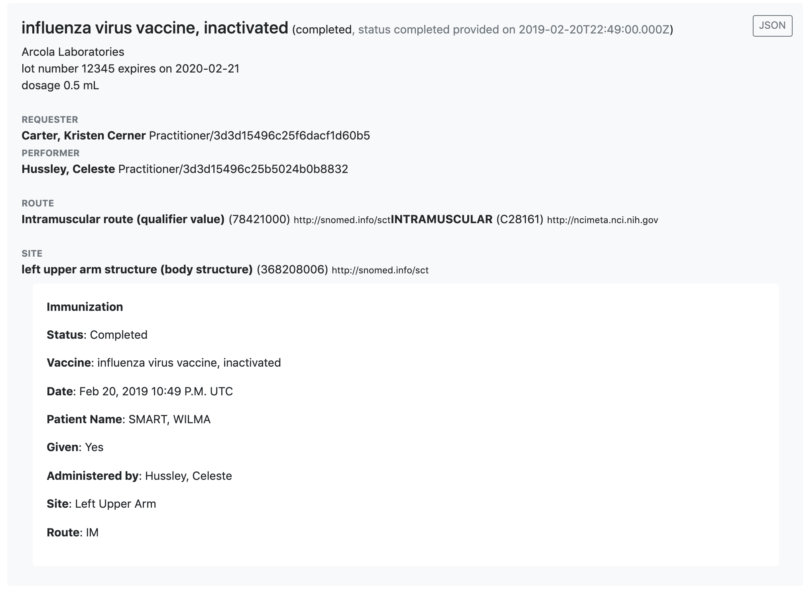

# Local Development
1. run  `npm link` in this folder to create the npm package locally
1. in the folder where you are using the package (some other project) run  `npm link fhir-react`
1. in that other project import this package as you would normally with `import {FhirResource} from 'fhir-react'`
1. use like this in jsx `<FhirResource fhirResource={...fhirResourceJsonObj} />`
1. Finally, in this fhir-react folder run the watch command via `npm start` and start developing.

# Build
`npm run build`

# Publish to NPM Registry
`npm publish`

# Examples:
Note: All screenshots are of test patient data, NOT real data

### Patient

### Allergy Intolerance

### Diagnostic Report

### Encounter

### Immunization

### Observation

# Usage

### Resources
- `this.props.thorough` = if this is set to `true`, or if it is absent, all array items and supported attributes will be displayed. Otherwise if this is `false` then only the first or otherwise important items will be displayed
